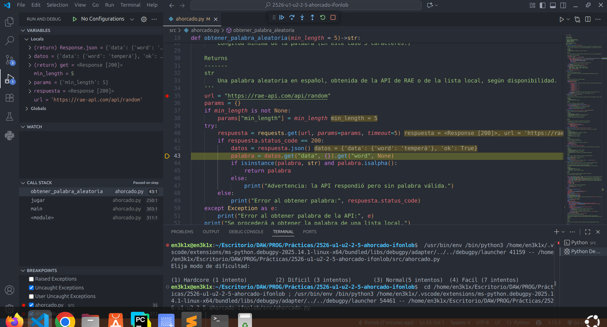
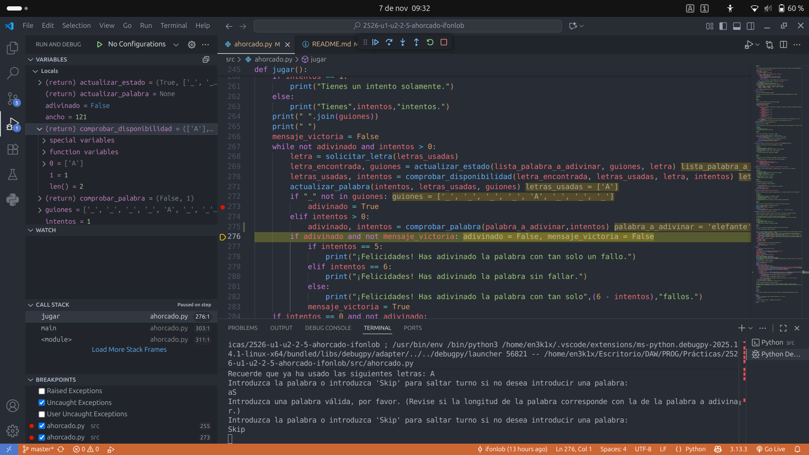

# Juego del Ahorcado en Python.

## Índice

- [Descripción del módulo](#descripci%C3%B3n-del-m%C3%B3dulo)
- [Requisitos del sistema](#requisitos-del-sistema)
- [Instalación de Python](#instalaci%C3%B3n-de-python-en-los-diferentes-sistemas-operativos)
- [Ejecución del módulo](#ejecuci%C3%B3n-del-m%C3%B3dulo)
- [Uso del archivo dependencias.txt](#uso-del-archivo-dependenciastxt-opcional)
- [Evidencias depuración](#evidencia-depuración)
- [Validaciones y mensajes de error](#validaciones-y-mensajes-de-error)
- [Problemas frecuentes (FAQ)](#problemas-frecuentes-faq)


## Descripción del módulo

Este proyecto implementa el clásico **Juego del Ahorcado** en consola, donde:

- El programa selecciona automáticamente una palabra secreta (mínimo 5 letras) desde una API (o una lista si no hay conexión).
- El usuario debe adivinar dicha palabra **letra a letra**.
- El número de intentos permitidos es limitado (por defecto, 6).
- Permite adivinar la palabra entera en cualquier momento.
- El juego controla letras ya usadas, rechaza entradas no válidas y muestra el estado tras cada jugada.

**Uso:**
  > python ahorcado.py 
  
**Ejemplo destacado de ejecución:**

```
======================
  JUEGO DEL AHORCADO
======================
Bienvenido al juego del ahorcado. La palabra a adivinar posee 7 letras distribuidas de la siguiente forma:
Tienes 6 intentos.
_ _ _ _ _ _ _
Ahora indique una letra:
> E
La letra introducida no se encuentra en la palabra.
Tu palabra se queda de la siguiente forma:
_ _ _ _ _ _ _
Te quedan 5 intentos.
Recuerde que ya ha usado las siguientes letras: E
...
¡Felicidades! Has adivinado la palabra con tan solo 2 fallos.
```


## Requisitos del sistema

- **Python 3.10 o superior**.
- **Requisitos para palabras por API:** `requests` (añádelo a dependencias).
- Si usas más librerías, anótalas en el archivo `dependencias.txt`.

## Instalación de Python en los diferentes sistemas operativos

### Linux

#### Debian/Ubuntu

```bash
sudo apt update
sudo apt install -y python3 python3-pip python3-venv
python3 --version
python3 -m pip --version
```

#### Fedora

```bash
sudo dnf install -y python3 python3-pip python3-virtualenv
python3 --version
python3 -m pip --version
```

#### Arch/Manjaro

```bash
sudo pacman -S --needed python python-pip
python --version
python -m pip --version
```

**Recomendación:** Usa entorno virtual e instala las dependencias necesarias directamente en él:

```bash
pip install virtualenv
virtualenv env
source ./env/bin/activate
```

### Windows

#### Microsoft Store

```cmd
py --version
py -m pip --version
```

#### Instalador oficial

Descarga: https://www.python.org/downloads/
No olvides activar “Add Python to PATH”.

**Entorno virtual:**

```cmd
py -m venv .venv
.venv\Scripts\Activate.ps1
```


## Ejecución del módulo

### Sintaxis general

```bash
python ahorcado.py
```

El juego selecciona automáticamente una palabra desde una API.

## Uso del archivo dependencias.txt (opcional)

Si usas librerías externas, inclúyelas en el archivo `dependencias.txt`.


Para instalar dependencias:

```bash
python3 -m pip install -r dependencias.txt
# o en Windows
py -m pip install -r dependencias.txt
```

Si el archivo no existe o está vacío, no se necesitan dependencias adicionales.

# Evidencia depuración

A lo largo del desarrollo del progama he utilizado en numerosas ocasiones el depurador o Python debugger integrado en VSC gracias a la extnsión "Python".

Cabe destacar que me ha ayudado en situaciones desafiantes en las cuales necesitaba saber el valor exacto que tomaban las variables a lo largo del transcurso del programa.

Un ejemplo de ello es en la función `obtener_palabra_aleatoria()` la cual recibe una palabra de una API. El depurador en este caso me ha favorecido de tal forma que me ha permitido comprobar si la API devolvía valores válidos.



Asimismo, me ha permitido colocar diversos puntos de ruptura con el fin de observar el flujo del programa más fácilmente.


Como se puede observar, gracias al depurador se puede descubrir en tiempo real cada uno de los valores de las diferentes variables del programa facilitándonos el trabajo.


## Validaciones y mensajes de error

- **Palabra inválida desde API:**
  `No se pudo obtener la palabra de la API. Se usará una palabra local.`
- **Letra inválida** (más de un carácter, número, símbolo o ya usada):
  `Por favor, introduzca una letra solamente.`
  `Ya has introducido esa letra, introduzca una diferente.`
- **Letra no está en la palabra:**
  `La letra introducida no se encuentra en la palabra.`
- **Letra acertada:**
  `¡Bien! La letra X está en la palabra.`
- **Victoria:**
  `¡Felicidades! Has adivinado la palabra con tan solo N fallos.`
- **Derrota:**
  `Has perdido. La palabra era: PALABRA`
- **Entrada de palabra incorrecta:**
   Mensajes de longitud/validación acorde con lo solicitado.


## Problemas frecuentes (FAQ)

- **Fallo al obtener palabra de API:**
  Comprueba conexión a internet. El juego funcionará con palabras locales si hay error.
- **Problemas con 'pip' o dependencias:**
  Instala manualmente o revisa dependencias.
- **No reconoce 'requests':**
  Instala con: `python -m pip install requests`
- **Pantalla no se limpia correctamente:**
  Prueba `os.system('clear')` (Linux/Mac) o `os.system('cls')` (Windows).
- **Teclas especiales (tildes, ñ):**
  El juego solo acepta letras del alfabeto estándar, sin carácteres especiales ni tildes.

